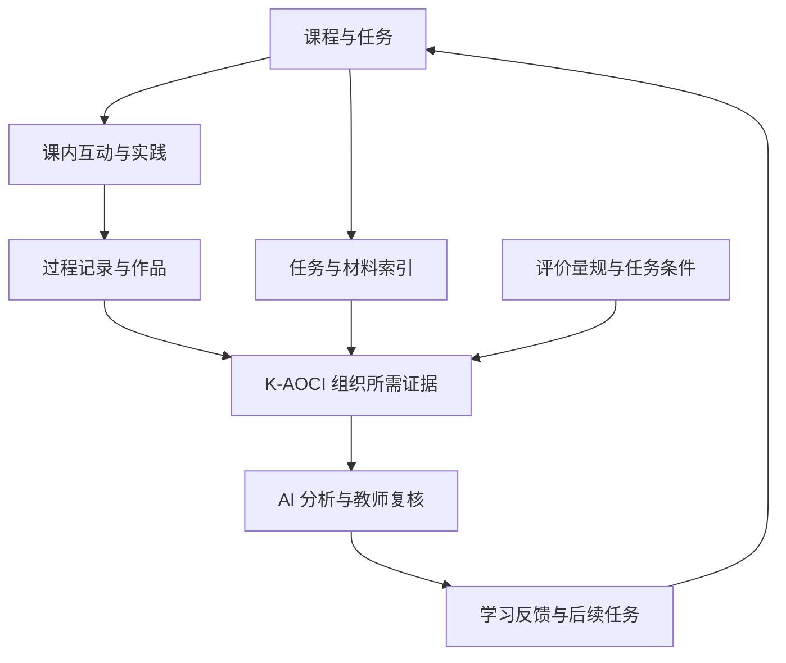

# AI 通识与人机协同产品方案：历史对话归档

来源：ChatGPT 对话[《评价人工智能课程》](https://chatgpt.com/c/6aa520c7-5f34-83ec-89c6-1893a4435ebb)。2026-09-17 从当前应用可访问的历史记录恢复。以下内容是历史讨论与目标设计，不代表当前代码已实现，也未在本次重新核验其中的外部研究、竞品描述和工期估算。

## 用于当前研发的结论

- 先补齐已存在的功能入口与运行流程：论坛通知、Agent 运行和历史、模块真实健康检查。
- AI 训练专区的下一阶段以 P1、P2、P7 三个已有任务为样本，优先完善过程证据，重点观察意图清晰、批判性核验、迭代优化。
- 原始事实、AI 分析、教师确认分开保存；判断可回到原始材料，证据不足不判为能力不足，使用帮助本身不扣分。
- 平台内先核对任务/材料版本、参与方式、操作结果、帮助来源、采纳与修改理由的记录缺口，再定义 K-AOCI 证据输入与教师复核合同。跨平台课件启动仍受 D-7 合同约束。
- M4 中文关键词包、P4 聚类、P5 推荐探究仍是后续候选；按新增的教学价值与证据需要排序，不仅按实验数量推进。
- 2026-09-14 的后续讨论强调普及性、普通教师可组织、普通学校现有设备可参与；区分真实训练、已有模型应用和明确标注的原理模拟。

尚未确认仓库 README 提到的《AI训练专区实验体系》独立页面地址。本归档恢复的是已找到的产品总方案及其更早的分阶段方案，不能据此声称找到了该同名页面。

## 用户明确的优先级（2026-09-13）

原消息 ID：86f912c0-56ef-445c-8142-f6152dbd9b63

> 我觉得这些实验室开发都是一个功能不足，其实最核心的还是我们起那面讨论的K-AOCI能让我们在能力评估上跑起来，对吧，这些实验的学情记录，对人机协同能力的判断，可能才是壁垒，因为K-AOCI是我们的专利

## 完整产品方案（2026-09-13）

原消息 ID：a3caedb0-4343-4379-b024-4f1bef6de46b

用户请求：你基于前面的讨论，总结出来一个完整的，符合偶们定位的产品方案

**我们的产品应定位为：面向区域普及，以 K-AOCI 支持学习过程分析的人工智能通识与人机协同能力成长体系。**

产品交付包括课程、实践环境、教学工具、能力评价和教师支持。学生通过理解原理、开展实验、解决问题，逐步形成与 AI 协作的能力；平台持续保存有意义的过程证据，帮助教师判断学生的进展，并安排后续学习。

下面这份方案可以作为后续各模块 PRD 的共同依据。新增能力均属于目标设计，具体实施以现有系统盘点和实际验证为基础。

**产品首先服务普通学校的日常教学，并支持区域持续推广。**

| 使用者 | 核心需求 | 产品应提供的价值 |
|---|---|---|
| 学生 | 理解 AI，能够运用并判断它的结果 | 有引导的课程、可操作的实验、可持续修改的作品、具体的成长反馈 |
| 教师 | 能上课、能组织实践、能看懂学生的问题 | 配套资源、课堂任务、班级共性问题、可回查的评价依据和教学建议 |
| 学校 | 稳定开课，适应不同设备与师资条件 | 灵活的教学组织方式、实施支持、课程与教师发展记录 |
| 区域教育管理者 | 扩大覆盖，同时改善教学质量 | 区域资源管理、教师支持、实施情况与教学改进依据 |
| 教研与评价团队 | 验证课程和评价方法 | 经授权使用的任务、过程证据、教师标注和跨任务表现 |

地区和学校购买的，应当是一套能够持续开展教学的服务。实验室是其中重要的实践环境，K-AOCI 支持的证据分析与能力成长服务是重点建设方向。

科大讯飞的公开方案已经包含学习轨迹、即时反馈和学期素养评价。因此，我们的差异需要具体体现为：**怎样解释过程证据、怎样让教师复核、怎样跨任务观察成长，以及怎样据此改善教学。** [科大讯飞官方方案](https://edu.iflytek.com/about-us/news/special-column/1331.html)

**课程保留现有 A+B 框架，同时把知识理解与人机协同贯穿起来。**

总体资源框架沿用现有的 **384 课时：A 轨 192 课时，B 轨 192 课时**。

- **A 轨承担通识基础。**围绕智能感知、数据与学习、算法与模型、智能生成、人机交互建立基本认识。
- **B 轨承担应用与迁移。**让学生在具体问题中选择工具、组织材料、验证结果、改进作品。
- **实验能力由两轨共同调用。**同一个图像训练模块，可以服务基础概念课，也可以服务校园调查项目。
- **十项人机协同能力贯穿任务设计。**每项活动选择适合观察的能力，形成连续的学习记录。

小学阶段保留 A/B 配对设计；初高中沿用四课时项目模块的组织方式。学校根据课程安排使用资源，平台支持不同实施节奏。

内容需要分层：

| 学段 | 主要学习要求 | 产品支持方式 |
|---|---|---|
| 小学低年级 | 观察、比较、表达发现，知道 AI 会出错 | 图片与实物任务、教师引导、简短口头解释 |
| 小学高年级 | 认识数据作用，开展简单对照，说明选择理由 | 预置数据与自主采集结合、轻量训练、作品修改 |
| 初中 | 定义问题、设计测试、解释错误、判断适用范围 | 完整实验流程、生成式 AI 核验、跨学科项目 |
| 高中 | 比较方案、组织复杂任务、解释技术与社会取舍 | 数据分析、自然语言编程、系统设计与选修技术实验 |

Python、神经网络细节和硬件工程可以提供深入学习路径。通识层面的编程重点放在需求、逻辑、约束、测试和修改上；自然语言编程也必须落实这些要求。

声音课程进入首批内容校准范围，清楚区分声音特征、模板匹配、声音分类、语音转文字和语音合成。基础原理与现代实现之间的关系，需要通过适合年龄的解释呈现。

**学生的学习体验应保持连贯，同时允许课后继续探索。**

学生端建议以三个入口为主：

| 入口 | 主要内容 |
|---|---|
| 我的学习任务 | 课程、实验任务、教师反馈和下一步学习 |
| 探索与实验 | 独立实验入口、开放探索、适合当前阶段的项目 |
| 我的作品与成长 | 数据集、模型、作品版本、重要学习证据和阶段反馈 |

课堂中，学生从 HTML 课件直接进入实验，完成后回到课程问题；课后从实践平台打开同一个项目继续修改。

例如图像识别任务可以分成两个课时：

第一课时提出预测、准备数据、训练并测试；第二课时交换测试条件、分析错误、修改方案，并说明模型的使用范围。

生成式 AI 任务也有相应过程：明确问题和成功标准，使用 AI，检查输出，决定如何修改，解释最终采纳的内容。Experience AI 将原理学习衔接到问题解决；Day of AI 的七年级课程也把核验、偏差和人的判断纳入学习过程，这些设计可以作为参考。 [Experience AI](https://experience-ai.org/en/units/solving-problems-with-ai-11-14)、[Day of AI](https://dayofai.org/units/grade-7-thinking-critically-about-ai)

**实践中心提供共享实验能力，并明确每项活动实际在做什么。**

产品应标明活动性质，允许同一节课组合使用多种方式：

| 活动性质 | 学生在做什么 | 典型内容 |
|---|---|---|
| 原理交互与模拟 | 改变条件，观察关系，建立概念 | 采样演示、规则推演、推荐机制模拟 |
| 真实模型训练 | 用数据建立或调整模型，并测试结果 | 图像分类、表格分类、短声音分类 |
| 使用已有模型 | 调用已有 AI，研究其表现与边界 | 语音转文字、图像理解、生成式 AI |
| 人机协同项目 | 综合运用知识与工具完成任务 | 校园调查、信息核验、应用制作、方案论证 |

预置数据也可以用于真实训练；已有模型也可以支持有价值的协同学习。界面中的训练进度和性能指标必须对应实际计算，原理动画应明确说明。

实践能力按以下范围建设：

| 能力区域 | 代表任务 | 主要学习价值 |
|---|---|---|
| 图像训练 | 模型认的是物体还是背景；换环境后是否有效 | 数据偏差、测试设计、错误分析 |
| 表格与决策树 | 比较人工规则与数据生成的分类规则 | 特征、分类依据、规则边界 |
| 声音实验 | 采集短声音、训练分类、换环境测试 | 声音特征、噪声、泛化 |
| 生成式 AI 核验 | 检查校园资讯或调查报告中的事实与依据 | 来源核验、判断与修正 |
| 数据与推荐 | 分析校园数据；观察推荐结果如何变化 | 证据使用、取样、目标与影响 |
| 自然语言编程 | 制作一个有明确要求的小工具 | 需求表达、测试、调试与验收 |
| 综合应用 | 将模型、数据和生成工具组合成作品 | 任务编排、人机分工、责任判断 |
| 进阶扩展 | 传感器、机器人、进阶模型实验 | 面向有条件学校与兴趣学生的深入学习 |

底层引擎应复用，教学任务可以丰富。Code.org 的 AI Lab 就展示了通过可配置的数据、特征选择和教学提示，让同一环境服务不同课程的方式；其独立代码仍需要接入项目保存等平台能力。 [Code.org AI Lab 官方仓库](https://github.com/code-dot-org/ml-playground)

**K-AOCI 的产品职责，是为当前教学与评价问题组织可理解、可回查的材料和证据。**

我们此前确定的技术定位继续保留：

- 任务与材料索引保留知识内核、条件结构、教学用途和原始定位。
- 学生操作、对话、作品修改和教师观察保存为过程事实。
- AI 根据当前问题，借助 K-AOCI 选择需要查看的材料与记录，建立关系。
- 能力判断保留依据、适用条件和不足之处，支持教师复核。
- 后续任务根据教学目标、学生表现和证据缺口进行推荐。

产品中的关系可以这样理解：

K-AOCI 支持证据组织与分析；评价是否成立，还要依靠量规、原始依据和验证工作。

延续你强调的局部增量原则：一次变化更新相应材料或事实记录，动态次数、进度和能力状态留在业务数据中。跨对象关系根据当前问题分析，避免为每次学习变化重写全套索引。

**能力评价必须能说明依据，并尊重学生获得帮助和参与实践的实际条件。**

沿用现有十项能力，观察点可以落实为：

| 能力 | 可观察的任务表现 |
|---|---|
| 问题建构 | 能否说明要解决什么问题，以及相关条件 |
| 意图清晰 | 能否表达目标、要求和成功标准 |
| 策略性提示 | 能否提供合适上下文，调整提问与协作方式 |
| 批判性核验 | 能否检查来源、寻找反例、验证结果 |
| 迭代优化 | 能否根据证据修改方案并检查效果 |
| 思维外显 | 能否用简短理由、草图或说明表达关键判断 |
| 元认知调节 | 能否发现理解不足，选择求助或调整方法 |
| 模式识别 | 能否从不同案例中发现共同规律 |
| 多元视角 | 能否考虑其他解释、使用者或受影响者 |
| 迭代韧性 | 遇到问题后，能否有目的地调整、求助和继续尝试 |

每个任务选取两三项重点观察即可。知识理解与协同表现分别呈现。

其中要明确几项评价规则：

- **使用 AI 帮助本身不扣分。**观察学生怎样选择、理解、检验和采纳建议。
- **没有观察机会，记为证据不足。**投屏观看和独立操作应分别记录。
- **小组成果需要结合个人贡献。**不能直接把作品水平归给每个成员。
- **一次任务提供阶段性证据。**持续能力判断需要不同任务中的表现。
- **操作次数和停留时间是辅助信息。**重复训练可能出于探索，也可能出于无目的尝试，需要结合上下文解释。

对低年级学生，可以用口头说明、选择理由和教师观察记录思考；只在关键节点安排表达，保持课堂活动的自然节奏。

**学习记录要足以解释行为，同时控制采集负担。**

每个任务至少需要关联以下信息：

| 信息 | 保存目的 |
|---|---|
| 任务、材料与版本 | 知道学生当时面对什么要求 |
| 参与者与参与方式 | 区分个人、小组、教师演示 |
| 初始目标或预测 | 理解后续选择的出发点 |
| 关键操作及其结果 | 保存真实过程与反馈 |
| 教师、同伴和 AI 的帮助 | 理解建议来源与学生的采纳情况 |
| 作品或模型的修改 | 判断修改内容及前后关系 |
| 关键理由、核验与反思 | 支持能力分析 |
| 评价依据与教师修订 | 保证判断可回查、可纠正 |

原始事实、AI 分析和教师确认应分别保存。AI 的解释不能覆盖原始记录。

例如，学生删除了某组数据，系统只掌握“删除”这一事实时，应保留不确定性；结合学生说明和后续测试，才能判断他是否识别了数据问题。

**能力反馈最终要帮助教师决定怎么教，也帮助学生知道下一步怎么做。**

教师端应优先呈现：

- 班级在哪些问题上存在共同误解；
- 哪些学生需要进一步观察或帮助；
- 哪些关键判断有证据支持；
- 哪些结论存在歧义，需要教师复核；
- 下一节课可以怎样讲解、分组或安排任务。

一条有效反馈可以采用这样的形式：

> 本次任务中，学生发现更换背景后模型表现下降，并主动补充了不同背景的数据，表现出根据测试结果调整方案的行为。现有记录尚不足以判断他能否自行设计独立测试。建议下一次提供新场景，让学生先提出测试办法。

学生看到的是清楚、可行动的反馈；教师可以进一步打开原始操作、作品与说明。

区域端则关注开课覆盖、实践机会、教师支持需求、任务实施质量和教学改进。跨学校比较需要保留设备、课时、参与方式等条件，避免把实施条件差异解释为学生能力差异。

**现有平台继续分工，K-AOCI 作为共享能力接入。**

| 平台或能力 | 建议承担的职责 |
|---|---|
| Identity | 身份、平台注册、可信入口和跨平台登录衔接 |
| TE-DNA | HTML 课件、教案、实验任务模板、教学资源生产与发布 |
| EDU | 课程组织、班级任务、参与与提交、教师反馈及教学评价记录 |
| AI 实践平台 | 实验运行、数据集、模型、项目、对话与作品版本 |
| K-AOCI 相关服务 | 材料与任务索引、按问题组织证据、支持分析与后续任务选择 |
| 统一评价能力 | 量规版本、分析记录、教师复核、阶段性反馈与成长观察 |

完整实验的运行能力和学生项目归实践平台；课程平台负责教学组织与嵌入。波形观察、规则演示等紧贴讲解的轻量交互，可以继续留在课件中。

同一份实验事实保留一个来源，其他平台通过关联读取。具体接口和部署方式在源码盘点后确定，沿用现有身份、组织、权限与发布机制。

**普及性应成为每一项功能的设计要求。**

基础产品支持三种教学条件：

| 教学条件 | 支持方式 | 评价处理 |
|---|---|---|
| 教师投屏 | 教师运行，学生预测、讨论、提交简短判断 | 记录观察与判断证据 |
| 小组共用设备 | 分工采集、测试、解释和汇报 | 保存小组成果及可识别的个人贡献 |
| 学生独立设备 | 独立训练、测试、修改与继续探索 | 保存个人实验过程 |

首期优先普通浏览器和小规模训练。模型资源、缓存和弱网恢复需要实际验证；没有摄像头或麦克风时，可使用预置材料完成相应学习目标。

硬件作为扩展。同一个问题可以通过屏幕结果、数据回放或物理装置展开，记录清楚参与方式。

图片和声音优先在本地处理；需要保存或分享的材料按实际教学用途和权限管理。跨设备继续训练所需的数据、配置和版本应明确保存范围。

成本也要分清：本地训练不产生模型 API 调用费，但仍有设备、存储、传输和维护成本；生成式 AI 分析与生成按实际用量管理，沿用现有“谁的智能体花谁的积分”规则。

**核心优势需要通过教学实践和对照验证逐步建立。**

你们的 K-AOCI 专利是重要技术资产。产品优势还需要通过课程、证据组织、评价质量和持续应用共同体现。

建议同步推进两类验证：

| 验证对象 | 需要回答的问题 |
|---|---|
| K-AOCI 的技术贡献 | 是否更准确地找到所需证据，减少遗漏和无依据判断；成本与响应时间如何 |
| 能力评价的有效性 | 教师是否认可证据解释；学生在新任务中是否表现出相应能力；建议是否有助于后续教学 |

K-AOCI 的对照实验应保持任务、模型、量规和可访问材料尽量一致，比较证据定位、关键证据遗漏、无依据结论、教师复核结果和分析成本。

评价研究与工程开发同步开展。你们与北师大推进的评价研究，可以围绕真实课堂材料进行量规修订、教师标注和迁移任务验证。早期结论以形成性反馈为主，随着证据积累再完善更稳定的评价方式。

**实施按阶段交付，首期就包含能力评价所需的完整过程。**

以下为初步工程估算，前提是能够获得现有代码、接口和试点支持；评价研究按课堂和学期持续推进。

| 阶段 | 主要交付 | 完成标志 | 初步周期 |
|---|---|---|---|
| 0 产品与基础盘点 | 现有能力清单、平台分工、学习记录规范、首批任务与观察点、设备测试 | 首期范围及依赖明确 | 1—2 周 |
| 1 最小教学闭环 | 图像训练能力、两个训练任务、一个生成式 AI 核验任务、项目保存、证据分析与教师复核 | 三个任务能够从授课运行到反馈和后续任务 | 追加 4—6 周 |
| 2 基础实验覆盖 | 表格与决策树、短声音分类、共约 8—10 个任务模板、版本比较与规范测试 | 多类课程复用实验能力并产生可用证据 | 追加 3—5 周 |
| 3 综合协同应用 | 数据分析、自然语言编程、推荐探究、模型应用制作 | 能在不同类型任务中观察协作表现 | 追加 4—6 周 |
| 4 区域推广与评价验证 | 多校实施、教师支持、区域资源管理、跨任务成长观察 | 形成持续教学和评价改进机制 | 按学期推进 |
| 5 进阶扩展 | 硬件、进阶编程、复杂模型与系统项目 | 根据学校需求和基础独立验收 | 单独立项 |

工程交付需要技术负责人、教研人员、试点教师和测试支持共同参与。各阶段均沿用已有 Harness、Workspace 和正式发布机制，使用明确的新任务范围推进。

**首期具体交付三个任务，集中观察三项能力。**

| 首期任务 | 共用能力 | 重点观察 |
|---|---|---|
| 模型认的是物体还是背景 | 图像训练、错误样本查看 | 意图清晰、批判性核验 |
| 换一个环境还能识别吗 | 同一图像引擎、版本对照、独立测试 | 批判性核验、迭代优化 |
| AI 给出的校园资讯可信吗 | 现有 AI 对话、资料引用、修改记录 | 意图清晰、批判性核验、迭代优化 |

首期交付范围包括：

- 三个完整教学任务及教师使用说明；
- 一套可被课件调用的图像训练能力；
- 项目保存、重新打开和版本比较；
- 关键过程记录与原始证据关联；
- K-AOCI 支持的材料与证据组织；
- AI 分析、教师修订及反馈发布；
- 一个用于继续观察的后续任务入口；
- 基础班级视图、权限控制和用量记录。

其余七项能力保留在总体框架中，后续根据任务和验证进展逐步加入。

**交付与商业安排围绕区域持续实施组织。**

| 交付组合 | 包含内容 |
|---|---|
| 普及教学服务 | 核心课程、基础实验、教学任务、基本证据反馈、教师入门培训 |
| 区域持续服务 | 本地资源管理、教研支持、教师陪跑、实施分析与评价校准 |
| 进阶模块 | 综合应用、复杂实验、硬件及相关专项支持 |
| 本地化部署服务 | 按地区要求配置语言、身份、数据托管和运维支持 |

价格需要基于试点测算，分别核算平台与课程服务、模型调用、存储运维、教师支持及可选硬件。国际版本沿用核心框架，任务情境、语言、教学要求与部署条件按当地需要调整。

**首期验收要同时检查课堂可用性、证据质量和教师使用价值。**

技术上，验证真实训练、保存恢复、版本对应、班级并发和权限隔离。

证据上，每条关键评价结论都能回到原始材料；能够区分学生行为、外部帮助和 AI 推断；证据不足时能够保留判断。

教学上，先选择设备条件不同的学校、小学高年级与初中班级试用，观察学生是否理解任务、教师能否完成课堂组织，以及反馈是否带来可执行的教学调整。

**首期最重要的验收场景是：教师能从一名学生的真实过程查看到一条有依据的能力判断，修订它，并据此安排一个新的观察任务；学生完成新任务后，平台能够保留前后表现及其条件。**

## 更早的实验室分阶段方案（2026-09-13，后续优先级以上文为准）

原消息 ID：20a74cf2-f2a2-423f-89dd-7f4bc7d68560

用户请求：你再搜索一下全球类似的人工智能教育的实验设计，帮我做一个分阶段的实验室实施方案，把前面提到的问题和要求都放进去。

**这轮全球调研后，我建议把你们要建设的区域定位为“AI 探究与人机协同实验中心”：同时支持理解原理、真实训练、检验 AI 和创作应用。** 前面提出的图像、声音、决策树训练仍然保留，但应放进这套更完整的教学结构。

最适合你们的路线是：**先做普通机房能用、与 HTML 课程相连、能留下学习证据的版本，再扩展实验种类、区域评价和可选硬件。**

以下方案结合了你上传的 A+B 课程框架、G7-03/G7-04 教案，以及截至 **2026 年 9 月 13 日**可核实的全球代表性项目。当前无法保存可下载附件，完整方案直接列在这里。

**全球案例最值得借鉴的，是怎样组织学生的判断与实验。**

| 项目与地区 | 可以核实的实验设计 | 建议吸收的做法 |
|---|---|---|
| **Experience AI，英国** | 当前模块让学生用苹果、番茄图片训练分类器，观察数据偏差；再选择问题和用户，训练、测试模型，并制作说明用途与限制的“模型卡”。基础模块更新于 2026 年 4 月，问题解决模块更新于 2026 年 8 月。 | 原理、训练、测试和应用边界连贯组织，适合初一零基础学生。[基础模块](https://experience-ai.org/en-US/units/understanding-ai-11-14)、[问题解决模块](https://experience-ai.org/en/units/solving-problems-with-ai-11-14) |
| **Code.org AI Lab，美国** | 学生选择表格数据、预测目标和特征，使用近邻分类或回归，保留验证数据、比较预测结果，保存模型及模型卡，供 App Lab 使用。 | 一个通用引擎支持多个课题；让学生决定“用什么数据预测什么”，并比较实验版本。[官方代码与设计说明](https://github.com/code-dot-org/ml-playground) |
| **MIT App Inventor PIC，美国** | 教程要求学生检查错误图片、改变距离和背景、提出错误原因假设，并与同伴讨论模型何时“足够好”，最后将模型用于应用。 | 错误分析、同伴测试和模型应用应成为正式环节。[官方实验教程](https://appinventor.mit.edu/explore/resources/ai/personal-image-classifier-part1) |
| **Teachable Machine，Google** | 无需编写机器学习代码即可训练图像、声音和姿态模型；公开了浏览器训练所用的机器学习代码。 | 复用成熟训练能力，降低开发门槛；教学流程和学情系统自主建设。[项目仓库](https://github.com/googlecreativelab/teachablemachine-community) |
| **LearningML，西班牙** | 收集带标签的文本或图片，建立模型，再接入 Scratch 制作交互应用。 | 训练后的模型应能进入学生自己的作品。[官方介绍](https://learningml.org/en/) |
| **Generation AI：Somekone，芬兰** | 通过社交媒体模拟器展示浏览、点赞怎样形成用户画像和推荐；教学材料明确说明它是仿真。 | 推荐算法、信息茧房和人的选择，也可以成为可操作的实验。[工具说明](https://gen-ai.fi/en/tools/somekone)、[教学材料](https://gen-ai.fi/en/materials/somekone-unit) |
| **Generation AI：Breakable Machine，芬兰** | 2026 年 3 月发布。学生改变背景、光线、角度，尝试让图像分类器出错，观察解释线索。 | 可以专门设计“找出 AI 弱点”的实验，认识置信度与正确性的区别。[官方说明](https://gen-ai.fi/en/tools/bm) |
| **Day of AI，美国及国际合作网络** | 当前七年级单元包含生成式 AI 错误、信息核验、偏差，以及自动化与人的能力。 | 从实验中心早期就纳入事实核查、人机分工和人的判断。[七年级单元](https://dayofai.org/units/grade-7-thinking-critically-about-ai) |
| **AI Unplugged，德国** | 学生根据卡片样本制定分类规则，交换规则，用新卡片测试，并解释分类依据。 | 没有电脑时仍能进行假设、规则和检验活动；随后再连接真实模型实验。[活动手册](https://www.aiunplugged.org/english.pdf) |
| **micro:bit CreateAI，英国** | 采集身体动作数据、训练动作模型、测试改进，再通过 MakeCode 用于设备项目。 | 硬件作为模型应用的扩展出口，适合条件较好的学校和社团。[官方资源](https://microbit.org/ai/) |
| **TensorFlow Playground** | 在浏览器中改变数据、特征和网络设置，观察训练与测试损失、分类边界。 | 为高年级提供可调变量的原理实验；初学者只开放少量必要控制。[实验页面](https://playground.tensorflow.org/) |

还有一个值得跟踪的方向：芬兰 **Little Language Machine** 允许在浏览器中训练、调整和检查小型语言模型。但其官方页面仍标注为开放测试阶段，预计 2026 年秋正式发布，因此适合作进阶研发参考。[官方说明](https://gen-ai.fi/en/tools/lm)

这些资料支持设计比较，还不能证明哪个平台普遍带来更好的学习效果。一项关于同伴测试的研究观察了 **11 名高中生、两周工作坊**，发现同伴测试促使学生反思数据数量、多样性和采集情境；它支持我们把同伴测试纳入设计，但不能直接推广成面向所有学段的效果结论。[原始研究](https://arxiv.org/abs/2311.12733)

**前面讨论的要求，应当成为实验中心从第一版就遵循的规则。**

| 已讨论的问题 | 方案中的落实方式 |
|---|---|
| 原理与操作怎样结合 | 每个实验先提出预测，操作后解释结果，再尝试新的情境 |
| 是否必须真实训练 | 标明每个环节属于原理模拟、真实训练或现成模型调用；允许一项活动包含多种性质 |
| 是否必须真实生活场景 | 任务尽量联系生活，数据和情境可以适度简化；学生的选择必须能够影响实验结果 |
| 会不会只是炫酷体验 | 必须留下错误样本、修改理由或使用边界，不能只提交“完成”截图 |
| 普通学校能否使用 | 浏览器优先，提供预置数据、现场采集、小组操作和教师演示路径 |
| 编程是否成为门槛 | 基础实验无需代码；自然语言编程和 Python 分别服务适合的进阶任务 |
| 怎样覆盖当代 AI | 基础训练与生成式 AI 核验、人机分工同时进入实验体系 |
| 怎样采集学情 | 保存任务、判断、操作和修改之间的关系，从首版开始设计 |
| 怎样支持人机协同评价 | 保留可解释的过程证据，明确学生、同伴和 AI 各自的贡献 |
| 怎样控制成本 | 小模型优先本地运行；AI 调用、文件存储和后续硬件分别核算 |

这里特别需要澄清：**预置数据也能用于真实训练；简化场景也能产生严谨实验；使用真实模型则不自动等于学生理解了原理。**

例如 Somekone 明确采用仿真，却能让学生观察推荐机制与个人选择的关系。它的教育价值来自变量可控、结果可见、解释可检验。

“真实训练”的判断也不应只看是否出现神经网络参数更新。近邻方法、决策树和神经网络的学习机制不同，关键是系统是否实际依据数据建立或调整了用于预测的模型。教学动画可以帮助解释，但应与真实运算记录清楚区分。

**整体产品建议采用一个实验中心，贯通课程任务、独立探索和作品积累。**

学生主要看到三个入口：

- **本课实验：**从 HTML 课件进入，自动带入任务、样本和引导问题。
- **继续实验：**打开以前的项目，继续测试、修改和完善作品。
- **自主探索：**选择教师开放的模板，提出自己的问题。

教师主要完成三件事：选择或配置实验、发布给班级、查看学生的过程与成果。

实验内部采用统一流程：

> 明确问题 → 提出预测 → 准备数据或材料 → 操作与检验 → 解释和修改 → 应用与说明边界。

不同课题可以省略不适用的步骤。例如，事实核验实验不需要“训练模型”；训练分类器则需要明确数据和测试过程。**流程应服务教学目标，避免每个实验都机械填写同一套表格。**

**建设分为六个阶段，第一轮建议正式立项到阶段二。**

| 阶段 | 主要目标 | 交付范围 | 进入下一阶段的条件 |
|---|---|---|---|
| **0．基础盘点与设计冻结** | 确定可复用能力、教学边界和数据合同 | 平台能力清单、设备基准、实验模板规范、学情事件规范、首批任务设计 | 范围、接口和试点条件清楚 |
| **1．课堂可用的最小版本** | 完成一次完整教学过程 | 图像训练、模型检验、项目保存、课程入口、教师查看；接入一项 AI 核验任务 | 普通机房真实班级能完成教学 |
| **2．基础实验室** | 建成三类训练和统一诊断能力 | 图像、表格／决策树、短声音分类；约 8—10 个教学模板 | 三类实验均能训练、检验、续做和提交 |
| **3．人机协同应用实验室** | 从模型实验扩展到真实问题解决 | 信息核验、数据论证、自然语言编程、推荐系统仿真、模型应用 | 学生能完成作品，并解释人的判断与修改 |
| **4．区域推广与评价验证** | 支持多校使用和持续改进 | 教师培训、区域资源管理、设备适配、评价校准、成本监测 | 教学、运行、评价三方面都有稳定证据 |
| **5．进阶与硬件扩展** | 服务选修、社团和高中探究 | 动作硬件、神经网络探究、小语言模型、强化学习、受控云端实验 | 有明确课程需求、设备条件和独立预算 |

下面把每个阶段落实到可开发、可验收的程度。

**阶段零先解决“接在哪里、教什么、记录什么”。**

这一阶段建议形成五项结果：

1. **已有能力盘点。**核实账号、班级、课件跳转、学生作品、文件存储、AI 调用和计费接口，区分已经上线与仍在规划的能力。
2. **实验模板规范。**每个模板明确目标、前置知识、学生可改变的变量、使用的数据或模型、应提交的学习证据。
3. **实验性质说明。**明确哪些是真实训练，训练哪部分；哪些是模拟；哪些调用已有模型。
4. **设备与网络基准。**选取试点学校实际电脑，检查模型加载、训练时间、内存、摄像头和麦克风条件。
5. **首批教学材料校准。**保留必要的声学、数据与算法基础，同时校准教学比喻和过于绝对的技术表述。

你们声音课程中的数字化、特征、噪声等内容可以继续作为基础。但“查找匹配”等简化过程，应说明适用范围。现代系统也可以从声音数据中学习表征，例如 wav2vec 2.0 的自监督声学表征学习，因此不能把固定模板匹配描述成所有现代语音识别的完整机制。[原始论文](https://arxiv.org/abs/2006.11477)

这一阶段先冻结最小必要的数据结构，后面逐步扩展，避免第一版收集的学习记录无法衔接后续评价。

**阶段一要交付一个能上课、能续做、能看到思考过程的版本。**

首个核心实验建议采用：**“模型认的是物体，还是背景？”**

学生使用文具或其他普通物体建立分类器，改变背景、角度或光线，检查模型表现，再依据错误调整样本。

必需功能包括：

- 创建类别，导入图片或现场采集。
- 使用学生数据进行真实训练，并显示真实运行状态。
- 查看预测结果和错误样本。
- 保存数据说明、模型及项目版本。
- 记录学生的预测、修改理由和适用范围说明。
- 从课件进入实验，完成后提交到班级任务。
- 教师查看项目进度和代表性错误。
- 重新打开项目，继续操作。

建议采用已有图像特征模型，加上实际训练的分类部分。这是成熟的浏览器迁移学习路径，应向学生说明预训练模型与本次训练的分工。[TensorFlow.js 官方教程](https://www.tensorflow.org/js/tutorials/transfer/image_classification)

同时接入一个轻量的**“AI 回答核验”任务**：学生先判断一段回答中哪些内容需要查证，再提供证据、修订答案。优先复用你们已有 AI 实践能力，使首轮试点同时观察模型实验和人机协同。

初一首次接触时，可以分两课完成：

- 第一课：预测、准备数据、训练与初次测试。
- 第二课：分析错误、修改、同伴测试、说明边界。

这样能给解释和反思留出时间。

**阶段二扩展到三类训练，同时做完整的实验诊断。**

| 实验能力 | 建议首批模板 | 需要理解的关键关系 |
|---|---|---|
| 图像分类 | 背景干扰、样本分布不均、标签修正 | 数据改变怎样影响模型 |
| 表格／决策树 | 选择预测目标、比较不同特征、限制树的复杂程度 | 分类依据、可解释性与过拟合 |
| 短声音分类 | 拍手／敲桌／环境声音、不同距离与环境测试 | 声音特征、噪声与泛化 |
| 现成语音能力检验 | 转写错误分析、不同表达或环境比较、语音合成效果比较 | 使用模型与训练模型的区别 |

这一阶段必须处理好训练、验证和最终检验：

- 用训练数据建立模型。
- 用验证样本比较修改方案。
- 留出未参与修改的样本做最终检验。
- 图像、声音尽量按采集批次、场景等分组，避免近乎重复的样本同时进入训练与最终测试。
- 保留模型版本与对应数据版本，防止拿不同条件下的结果直接比较。

这些设计用于减少数据泄漏导致的过度乐观评价。[官方说明](https://scikit-learn.org/stable/common_pitfalls.html)

对小学生，可以将这些表述为“学习样本、练习检查、最后挑战”；初高中再逐步引入正式术语。

声音区域需要分别标明：**声学观察、短声音分类训练、语音转写调用、语音合成调用。**这些环节可以在同一课程中连贯出现，但不能统一显示为“训练语音识别模型”。

**阶段三重点扩展你们的人机协同课程。**

| 实验方向 | 学生的主要任务 | 应提交的成果 |
|---|---|---|
| **信息核验** | 找出待核实主张，追查来源，判断证据是否支持结论 | 核验记录与修订答案 |
| **数据论证** | 清理数据，比较图表和解释，检查结论是否超过证据 | 数据支持的校园改进建议 |
| **自然语言编程** | 明确用户需求，提出验收条件，测试生成的软件，描述问题并修改 | 可运行作品、测试记录、修改说明 |
| **推荐系统仿真** | 改变偏好、行为或推荐参数，观察信息范围变化 | 实验对照与推荐机制解释 |
| **模型用于应用** | 将训练结果用于小游戏、辅助工具或网页交互 | 应用作品及适用边界 |

自然语言编程的学习重点应包括需求表达、任务分解、条件逻辑、测试和修改。Python 可保留给需要读改代码、处理数据或研究算法的进阶任务，基础实验不以掌握 Python 语法为前提。

这一安排与 UNESCO 学生 AI 能力框架强调的以人为中心、AI 伦理、技术应用和系统设计相契合；该框架也采用理解、应用、创造的递进层次。[UNESCO 框架](https://www.unesco.org/en/articles/ai-competency-framework-students)

**阶段四把实验中心变成可普及、可持续运营的教学能力。**

需要逐步补齐：

- 不同设备条件学校的适配与支持方案。
- 教师备课说明、常见误区、示范作品和课堂故障处理。
- 教师配置模板，地区复用和改编优秀实验。
- 模板、模型和评价规则的版本管理。
- 学生作品与过程证据的长期归档。
- 运行成功率、课堂完成情况、AI 用量与支持成本监测。
- 与你们正在研发的人机协同评价体系进行数据对接和校准。

教师基础功能从阶段一就要存在；这一阶段增加的是规模化管理和评价验证。

建议采用“同等难度的前后任务＋新的迁移任务＋教师抽样复核”。例如，学生在文具分类中学会控制背景，换到声音任务后，能否主动检查环境噪声和采集条件。这样的证据更接近是否形成了可迁移的认识。

**阶段五按课程需求扩展，硬件不成为普及课程的前置条件。**

可选方向包括：

- micro:bit 等动作采集与设备控制。
- 手势、姿态与网页作品连接。
- 神经网络结构和训练过程探究。
- 小型语言模型的数据、训练与输出实验。
- 强化学习与奖励设计。
- 高中选修所需的受控 Python 或云端训练环境。

每项硬件项目都应同时提供屏幕版或数据回放版，保留核心学习目标。两种版本的参与方式应如实记录。

比如“智能台灯”可以分为三个层次：

1. 用数据和屏幕交互理解感知、判断与控制。
2. 让学生根据测试结果调整判断条件或模型。
3. 有条件的学校再连接实体台灯，检验物理环境中的表现。

这样既保留工程实践价值，也便于地区推广。

**你们现有课程已有不少直接接入点，不需要为实验中心另编一整套平行课程。**

以下映射依据上传框架第二至第四部分，属于建议接入范围：

| 现有课题编号 | 可接入的实验 | 建设阶段 |
|---|---|---|
| G3-36／37、42／43 及对应 B 课 | 数据准备、模型训练、测试与错误诊断 | 1—2 |
| G4-50／50b | 手工规则树与数据生成决策树的比较 | 2 |
| G4-52／52b、G6-84／84b | 推荐机制与信息茧房仿真 | 3 |
| G7-01·02 | 图像分类、背景干扰、验证结果 | 1 |
| G7-03·04 | 声学观察、声音分类、转写与合成能力检验 | 2 |
| G6-82／82b | 合成内容核验与证据判断 | 1 起步、3 扩展 |
| G8-25b～28b | 自然语言编程与用户测试 | 3 |
| G10-05b～08b | 数据论证与校园改进建议 | 3 |
| G11-25b～28b | 专用助手的任务边界、知识依据和可靠性测试 | 3 后逐步扩展 |

你们的 A 轨负责概念、机制与解释，B 轨负责应用和迁移，实验中心提供二者共同使用的工具。

低年级以卡片、预置样本和教师带领为主；小学高年级、初一增加采样与对照；更高学段逐步开放参数、代码和系统设计。**同一引擎可以服务不同年级，开放的变量和要求提交的证据应随学习基础变化。**

**学情数据应围绕你们已有的十项人机协同能力组织。**

| 能力维度 | 可以观察的实验行为 |
|---|---|
| 问题定义、意图清晰 | 能否说明服务谁、解决什么问题、怎样判断成功 |
| 策略提示、思维外显 | 是否把任务条件、假设和要求表达清楚 |
| 批判核验、模式识别 | 是否寻找反例，能否发现错误中的共同条件 |
| 迭代优化、迭代韧性 | 修改是否有依据，失败后是否调整策略 |
| 多元视角 | 是否考虑其他使用者、其他情境和不同成功标准 |
| 元认知调节 | 能否说明自己还不确定什么、何时需要进一步核实 |

每个实验选择适用的两至四个维度即可，不必强行覆盖全部十项。

基础记录至少包括：

- 学生或小组、课程任务、实验模板版本。
- 数据版本、模型或工具版本、运行条件。
- 学生最初的预测与判断。
- AI 建议、学生采纳或修改的内容。
- 测试结果、错误样本和修改理由。
- 最终作品、使用边界和反思。

需要明确区分**教师演示、小组共作、个人独立完成**。集体活动不能自动变成每个学生都独立完成训练的记录；不适用的能力维度也不应计为零分。

训练次数、点击次数和模型准确率可以辅助分析，但不能直接等同于能力分数。

后续可将实验模板的知识点、教学用途、前置条件和证据要求纳入 K-AOCI 索引。实时运行状态、统计结果和评分保留在事实数据中，按需要回取，避免把频繁变化的统计量固化进索引。

**技术上建议沿用现有平台分工，实验中心主要落在 AI 实践平台。**

| 平台 | 建议承担的职责 |
|---|---|
| **Identity** | 统一身份、平台入口、可信跳转 |
| **TE-DNA** | 实验模板的教学配置、课件嵌入、教学资源发布 |
| **AI 实践平台** | 实验运行、训练引擎、数据与模型项目、AI 工具操作 |
| **EDU** | 班级任务、学生参与、作品提交、教师反馈和教学记录 |
| **现有计费体系** | AI 调用归属、实际用量和扣费记录 |

这是建议的职责边界，阶段零仍需用实际代码核实已有能力。

训练引擎集中维护，每个 HTML 课件通过模板调用。轻量模型优先在浏览器运行，服务器保存需要持久化的项目和成果。跨电脑继续训练需要保存相应样本或特征及配置；只保存模型权重，可以恢复预测，却未必能完整恢复训练过程。

工程上还要落实：

- 目标机房设备实测，不能把某种浏览器后端当作所有设备的保证。TensorFlow.js 官方也要求按设备和模型测试性能。[运行环境说明](https://www.tensorflow.org/js/guide/platform_environment)
- 页面、训练引擎和模型资源可由你们控制发布与缓存。
- 无摄像头、无麦克风时仍有预置数据路径。
- 原始音视频优先本地处理，保存与共享范围清楚。
- 断线、刷新、训练中止后有明确恢复方式。
- AI 调用沿用现有费用归属规则，记录实际用量。
- 复用开源前分别核对代码、模型和素材的许可；免费使用不等于可以直接商业重发布。例如 LearningML 网页本身标注了非商业许可，应用代码需要另行核实。[页面许可](https://learningml.org/en/)

**正式开发应按可验收的任务包推进，继续使用你们已有的 Harness。**

阶段不等于一个巨大的 Workspace。建议按依赖拆分：

| 待建任务包 | 主要产出 |
|---|---|
| 实验项目与数据合同 | 项目、模板、版本、成果和事件基础 |
| 图像训练引擎 | 采样、训练、预测、保存与恢复 |
| 课程入口与任务回传 | TE-DNA／EDU 与实验项目的连接 |
| 教师查看与学习证据 | 进度、错误、修改和作品查看 |
| 表格与决策树实验 | 特征选择、拟合、解释与比较 |
| 声音实验 | 声学观察、分类训练、现成语音能力接入 |
| 人机协同项目 | 核验、数据论证、自然语言编程与应用 |
| 区域运营与评价 | 模板管理、评价校准、使用与成本分析 |

每个任务分别确定允许路径、验收、Candidate、发布和恢复方式。使用执行时的最新 Trusted Baseline，不沿用旧对话中的过期状态，也不向已经关闭的任务追加需求。

模板和引擎升级后，要保证旧学生项目仍能按其原版本打开；不能让一次升级改变已经提交的实验结果含义。

**首轮验收要同时检查技术可用与教学有效。**

技术验收至少证明：

- 使用不同数据，模型确实据此建立或改变预测。
- 模型、数据和测试结果能对应到正确版本。
- 项目保存后可以重新打开，恢复能力与界面说明一致。
- 典型整班并发情况下能够完成实验。
- 设备缺失、弱网、刷新和中止不会造成混乱结果。
- 学生、班级和学校的数据可见范围正确。

教学验收至少检查：

- 学生是否先作出预测。
- 是否能指出一类错误及可能原因。
- 修改是否针对原因，并有新的检验证据。
- 是否理解“模型有把握”与“模型正确”的区别。
- 是否能说明适用范围和需要人工判断的情况。
- 换一个任务后，是否还能使用相应方法。

建议首轮选择 **设备条件不同的两所学校、四个班左右**，覆盖小学高年级和初一。这是试点建议，不是统计效力保证。先发现课堂与设备问题，再确定扩大范围和评价研究设计。

**周期和成本按阶段估算，先用试点校准。**

在熟悉现有系统的技术实施负责人、AI 辅助开发及教研测试配合的条件下，可先采用以下规划范围：

| 阶段 | 初步周期 |
|---|---:|
| 阶段零 | 1—2 周 |
| 阶段一 | 追加 3—5 周 |
| 阶段二 | 追加 3—5 周 |
| 阶段三 | 追加 4—6 周，取决于现有 AI 实践能力 |
| 阶段四 | 随区域试点推进 |
| 阶段五 | 按选修项目单独估算 |

因此，**首个完整课堂试点可按累计约 4—7 周规划，三类训练的基础实验室按约 7—12 周规划**。这些是范围估算，阶段零完成后才能形成可靠排期。

成本分开记录：研发与维护、资源存储与传输、生成式 AI 调用、教师培训与支持、可选硬件。浏览器本地训练不产生大模型 token 费用，但仍有设备计算、资源下载和维护成本。生成图片、语音和视频的费用应单列，避免掩盖在纯文本额度中。

**建议本轮建设范围确定为阶段零至阶段二，并从阶段一就加入基础 AI 核验和人机协同证据。** 首发交付物是一套可复用的实验流程、三类真实训练能力、约 8—10 个课程模板，以及课程入口、作品保存和基本学情记录。后续用课堂证据决定哪些实验值得扩展，哪些需要简化或调整。
